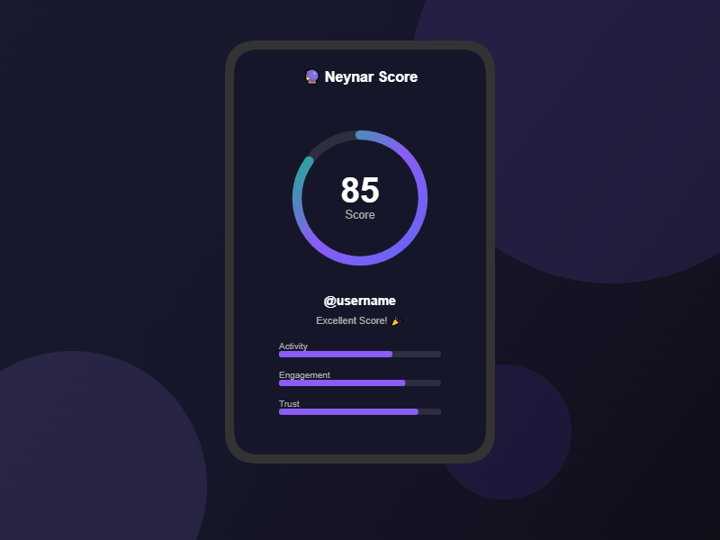

# 🔮 Neynar Score Checker - Farcaster Mini App

A beautiful Farcaster Mini App to check your Neynar reputation score with a stunning UI design.



## ✨ Features

- **🔐 Farcaster Login** - Automatic authentication via Mini App SDK
- **🎨 Beautiful UI** - Glass morphism design with animated score ring
- **👛 Wallet Integration** - Connect your Ethereum wallet via Wagmi
- **🔍 User Search** - Search any Farcaster user by username
- **📊 Score Analysis** - Get detailed breakdown with improvement tips
- **🔗 Social Sharing** - Share your score directly to Farcaster
- **📱 Mobile Optimized** - Responsive design for all devices

## 🚀 Quick Start

### Prerequisites

- Node.js 22.11.0 or higher
- npm, pnpm, or yarn
- Neynar API key (get one at [neynar.com](https://neynar.com))
- Farcaster account

### 1. Clone & Install

```bash
git clone <your-repo>
cd neynar-score-checker
npm install
```

### 2. Configure Environment

Copy the example environment file and fill in your values:

```bash
cp .env.example .env.local
```

Edit `.env.local`:

```env
# Required
NEYNAR_API_KEY=your_neynar_api_key_here
NEXT_PUBLIC_APP_URL=https://your-domain.vercel.app

# Farcaster Manifest (generate at https://farcaster.xyz/~/developers/new)
NEXT_PUBLIC_FARCASTER_HEADER=your_header
NEXT_PUBLIC_FARCASTER_PAYLOAD=your_payload
NEXT_PUBLIC_FARCASTER_SIGNATURE=your_signature

# Security
JWT_SECRET=your_jwt_secret_min_32_chars
```

### 3. Generate Farcaster Manifest Signature

1. Go to [Farcaster Developer Tools](https://farcaster.xyz/~/developers/new)
2. Enter your domain (e.g., `your-app.vercel.app`)
3. Click "Claim Ownership" and sign with your Farcaster account
4. Copy the `header`, `payload`, and `signature` values to your `.env.local`

### 4. Run Development Server

```bash
npm run dev
```

Open [http://localhost:3000](http://localhost:3000) in your browser.

### 5. Test in Farcaster

To test the Mini App in Farcaster, you need a public URL. Use a tunneling service:

```bash
# Using cloudflared
cloudflared tunnel --url http://localhost:3000

# Or using ngrok
ngrok http 3000
```

Then test using the [Farcaster Embed Tool](https://farcaster.xyz/~/developers/tools/embed).

## 🌐 Deploy to Vercel

### 1. Push to GitHub

```bash
git init
git add .
git commit -m "Initial commit"
git remote add origin <your-github-repo>
git push -u origin main
```

### 2. Deploy on Vercel

1. Go to [vercel.com](https://vercel.com) and import your repo
2. Add environment variables in Vercel dashboard:
   - `NEYNAR_API_KEY`
   - `NEXT_PUBLIC_APP_URL` (your Vercel domain)
   - `NEXT_PUBLIC_FARCASTER_HEADER`
   - `NEXT_PUBLIC_FARCASTER_PAYLOAD`
   - `NEXT_PUBLIC_FARCASTER_SIGNATURE`
   - `JWT_SECRET`
3. Deploy!

### 3. Update Manifest URLs

After deployment, update your `.env` with the real Vercel domain and redeploy.

## 📁 Project Structure

```
neynar-score-checker/
├── public/
│   ├── .well-known/
│   │   └── farcaster.json      # Farcaster manifest
│   └── images/                  # App images (icon, splash, og)
├── src/
│   ├── app/
│   │   ├── api/
│   │   │   ├── user/           # User data API
│   │   │   ├── verify/         # Token verification API
│   │   │   └── webhook/        # Farcaster webhook handler
│   │   ├── .well-known/        # Dynamic manifest route
│   │   ├── globals.css         # Global styles
│   │   ├── layout.tsx          # Root layout with metadata
│   │   └── page.tsx            # Main app page
│   ├── components/
│   │   ├── ScoreRing.tsx       # Animated score visualization
│   │   ├── UserCard.tsx        # User profile card
│   │   ├── SearchInput.tsx     # User search component
│   │   ├── WalletConnect.tsx   # Wallet connection button
│   │   └── ...
│   ├── lib/
│   │   ├── farcaster.ts        # Farcaster SDK utilities
│   │   ├── neynar.ts           # Neynar API utilities
│   │   └── wagmi.ts            # Wagmi configuration
│   └── providers/
│       └── Providers.tsx       # React providers (Wagmi, Query, Farcaster)
├── .env.example                # Environment template
├── next.config.mjs             # Next.js configuration
├── tailwind.config.ts          # Tailwind CSS theme
└── vercel.json                 # Vercel deployment config
```

## 🔧 Key Technologies

- **Next.js 14** - React framework with App Router
- **@farcaster/miniapp-sdk** - Farcaster Mini App SDK
- **@farcaster/miniapp-wagmi-connector** - Wallet connector for Mini Apps
- **Wagmi v2** - React hooks for Ethereum
- **TanStack Query** - Data fetching and caching
- **Framer Motion** - Animations
- **Tailwind CSS** - Styling

## 📱 Mini App SDK Features Used

- `sdk.actions.ready()` - Hide splash screen
- `sdk.context` - Get user info automatically
- `sdk.quickAuth.getToken()` - Get authentication JWT
- `sdk.actions.composeCast()` - Share to Farcaster
- `sdk.actions.openProfile()` - Open user profile
- `sdk.haptics.*` - Haptic feedback
- `sdk.wallet.getEthereumProvider()` - Wallet access

## 🎨 Customization

### Colors

Edit `tailwind.config.ts` to change the color scheme:

```ts
colors: {
  'neynar': { ... },
  'farcaster': { ... },
  'score': { ... },
}
```

### Score Thresholds

Edit `src/lib/neynar.ts` to adjust score levels:

```ts
export function getScoreLevel(score: number): ScoreLevel {
  if (score >= 0.8) return 'excellent';
  if (score >= 0.65) return 'good';
  // ...
}
```

## 📚 Resources

- [Farcaster Mini Apps Docs](https://miniapps.farcaster.xyz)
- [Neynar API Docs](https://docs.neynar.com)
- [Neynar User Score](https://docs.neynar.com/docs/neynar-user-quality-score)
- [Wagmi Docs](https://wagmi.sh)
- [Farcaster Developer Tools](https://farcaster.xyz/~/developers)

## 🔐 Security Notes

- Never expose your `NEYNAR_API_KEY` to the client
- The API key is only used in server-side API routes
- Quick Auth tokens are verified on the server
- Always validate user input on the server side

## 📄 License

MIT License - feel free to use this as a template for your own Mini Apps!

---

Built with 💜 for the Farcaster ecosystem
